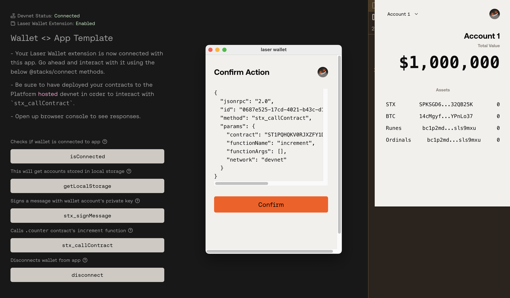
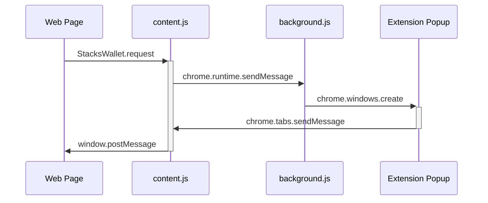

# DenVault



**DenVault** is a secure, non-custodial Bitcoin Layer 2 wallet for the Stacks ecosystem. Built as a Chrome extension with production-grade security.

## Features

### Security
- **AES-256-GCM Encryption** - Mnemonic encrypted at rest with PBKDF2 key derivation (100k iterations)
- **6-digit PIN Protection** - Max 3 attempts before lockout
- **Auto-lock** - Session expires after 5 minutes of inactivity
- **Memory Cleanup** - Private keys cleared immediately after signing
- **Content Security Policy** - Strict CSP in manifest

### Wallet
- **Multi-wallet Support** - Manage multiple wallets with custom names
- **Dynamic Accounts** - Add/remove derived accounts per wallet
- **Network Switching** - Mainnet, Testnet, and Devnet support
- **Real-time Balance** - STX balance with manual refresh
- **SIP-010 Tokens** - Display fungible tokens
- **Transaction History** - Recent activity from Hiro API
- **QR Codes** - For receiving STX, BTC, and Taproot addresses
- **Encrypted Backup** - Export/import wallet with PIN verification

### Addresses
| Type | Format |
|------|--------|
| Stacks | SP... (mainnet) / ST... (testnet) |
| Bitcoin P2PKH | Legacy format |
| Bitcoin P2TR | Taproot (Ordinals compatible) |

### RPC Methods
| Method | Description |
|--------|-------------|
| `getAddresses` | Get wallet addresses + network info |
| `stx_signMessage` | Sign a message |
| `stx_callContract` | Call a smart contract |
| `stx_transferStx` | Transfer STX tokens |

## Project Structure

```
stack-sats/
├── wallet-extension/   # Chrome extension (Manifest V3)
├── front-end/          # Test dApp (Vue/Vite)
└── clarity/            # Smart contracts (Clarinet)
```

## Quick Start

### Installation

```bash
# Install dependencies
pnpm install

# Build wallet extension
pnpm build

# Start test dApp
pnpm dev:frontend
```

### Load Extension in Chrome

1. Go to `chrome://extensions/`
2. Enable "Developer mode"
3. Click "Load unpacked"
4. Select the `wallet-extension` folder

### Development Commands

```bash
# From root
pnpm build           # Build wallet extension
pnpm dev             # Dev server for extension
pnpm dev:frontend    # Dev server for test dApp (localhost:5173)
pnpm test            # Run Clarity contract tests
pnpm test:wallet     # Run wallet unit tests (99 tests)

# From wallet-extension/
pnpm build           # Production build
pnpm dev             # Dev with hot reload
pnpm lint            # ESLint
pnpm type-check      # TypeScript check
```

## Architecture

### Message Flow



### Security Flow

```
Create Wallet → PIN → PBKDF2 → AES-Encrypt → chrome.storage.local
Unlock → PIN → PBKDF2 → AES-Decrypt → mnemonic in memory → Auto-lock 5min
Sign → Derive key → Sign transaction → Clear key from memory
```

## Configuration

### Environment Variables

Create `front-end/.env` from `.env.example`:

```bash
VITE_STACKS_NETWORK=platformdevnet
VITE_PLATFORM_HIRO_API_KEY=<your-api-key>
```

Get your API key from [Hiro Platform](https://platform.hiro.so/settings/api-keys).

### Network Support

| Network | Chain ID | API |
|---------|----------|-----|
| Mainnet | 1 | api.hiro.so |
| Testnet | 2147483648 | api.testnet.hiro.so |
| Devnet | 2147483648 | Platform Hiro (API key) |

## Smart Contract

The included `counter.clar` contract is for testing:

- `increment` - Increment counter variable
- `get-count` - Read current count

## Standards

- [WBIP](https://wbips.netlify.app/) - Wallet Best Practices
- [SIP-030](https://github.com/stacksgov/sips) - Stacks wallet integration
- [@stacks/connect v8](https://docs.hiro.so/stacks/connect) - Connection protocol

## Links

- [Privacy Policy](https://wolfcito.github.io/stack-sats/privacy.html)
- [Support](https://wolfcito.github.io/stack-sats/support.html)
- [Hiro Documentation](https://docs.hiro.so)

## License

Apache-2.0
