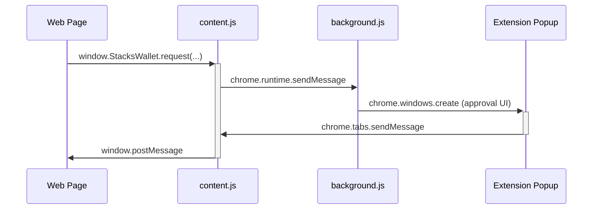

# DenVault

<!-- denlabs-meta
name: denvault
type: app
surface: public-wallet
status: public
owner: Wolfcito
pm: pnpm
repo: https://github.com/akawolfcito/stack-sats
url: https://akawolfcito.github.io/stack-sats/
scripts: [dev, build, test, lint]
-->

> **DenLabs Lab** · Product · Stacks
> Non-custodial Stacks and Bitcoin wallet, shipped as a Chrome Manifest V3 extension.

**DenVault** is an open-source, non-custodial wallet for the Stacks blockchain (a Bitcoin
layer) and for Bitcoin itself. Keys never leave the browser: the recovery phrase is encrypted
at rest with AES-256-GCM and unlocked with a 6-digit PIN.

> Independently developed by DenLabs. Not affiliated with Hiro or the Stacks Foundation.
> Review the source code before storing significant funds.

- Project site: https://akawolfcito.github.io/stack-sats/
- Privacy policy: https://akawolfcito.github.io/stack-sats/privacy.html
- Support: https://akawolfcito.github.io/stack-sats/support.html

## Status

| | |
|---|---|
| Extension version | 1.1.3 (`denvault-extension/public/manifest.json`) |
| Distribution | **Not yet listed on the Chrome Web Store.** Install by loading the built `dist/` unpacked. |
| Networks | Mainnet (default) and Testnet |
| Unit tests | 1268 tests across 81 files, all passing |
| E2E tests | 14 Playwright specs, 3 projects (popup, extension, side panel) |
| Public site | GitHub Pages, served from `main:/docs` |

The wallet is functional on Stacks mainnet and is under active development. It has not been
through an external security audit.

## What it does

### Wallet
- Create a wallet or import an existing BIP39 recovery phrase
- Multiple wallets, each with custom naming, plus add/remove of derived accounts
- Reveal the recovery phrase behind PIN verification
- Encrypted backup export and restore, gated by PIN
- Popup mode and Chrome side panel mode

### Assets
- STX balance, with fiat price display
- Send STX
- Send Bitcoin, including from Taproot addresses
- SIP-010 fungible tokens: discover, add custom tokens, manage the list, and send
- Transaction history and per-asset activity, sourced from the Hiro API
- QR codes for receiving on Stacks, Bitcoin P2PKH and Bitcoin Taproot

### Addresses derived per account

| Type | Format |
|------|--------|
| Stacks | `SP...` (mainnet) / `ST...` (testnet) |
| Bitcoin P2PKH | Legacy |
| Bitcoin P2TR | Taproot (Ordinals compatible) |

### dApp connectivity

Web pages get `window.StacksWallet` (injected by `injection.js`) and speak JSON-RPC 2.0
following @stacks/connect v8 and WBIP conventions. Implemented methods:

| Method | Description | User approval |
|--------|-------------|---------------|
| `getAddresses` / `stx_getAddresses` | Return wallet addresses plus network info | Yes, first time per origin |
| `stx_getAccounts` | Return connected accounts | Yes, first time per origin |
| `stx_signMessage` | Sign a message | Yes, every time |
| `stx_callContract` | Call a Clarity contract | Yes, every time |
| `stx_transferStx` | Transfer STX | Yes, every time |

Any method outside this list is rejected. Approvals are scoped per origin and are cleared
when the network changes.

## Repository layout

```
stack-sats/
├── denvault-extension/   # The Chrome extension (Manifest V3, Vue 3 + Vite)
│   ├── public/           # manifest.json, background.js, content.js, injection.js
│   ├── src/              # popup and side panel UI, wallet logic, security utils
│   ├── e2e/              # Playwright specs
│   └── scripts/          # build verification, packaging, UI audits
├── docs/                 # Public GitHub Pages site (index, privacy, support)
└── .github/workflows/    # CI
```

The pnpm workspace contains a single package, `denvault-extension` (package name
`wallet-extension`). Root scripts proxy into it.

## Architecture

### Message flow, page to wallet


```mermaid
sequenceDiagram
  participant w as Web Page
  participant c as content.js
  participant b as background.js
  participant p as Extension Popup
  w->>+c: window.StacksWallet.request(...)
  c->>b: chrome.runtime.sendMessage
  b->>+p: chrome.windows.create (approval UI)
  p->>-c: chrome.tabs.sendMessage
  c->>-w: window.postMessage
```

### Key lifecycle

```
Create/import → 6-digit PIN → PBKDF2(600k) → AES-256-GCM encrypt → chrome.storage.local
Unlock        → PIN → PBKDF2 → AES-256-GCM decrypt → mnemonic held in memory → auto-lock timer
Sign          → derive private key on demand → sign → wipe the key from memory
```

## Getting started

Requires Node 22+ and pnpm.

```bash
pnpm install
pnpm build          # type-check + production build into denvault-extension/dist/
```

Then load it in Chrome:

1. Open `chrome://extensions/`
2. Enable **Developer mode**
3. Click **Load unpacked**
4. Select `denvault-extension/dist`

### Development

```bash
pnpm dev            # Vite dev server with hot reload
pnpm test           # Unit tests (vitest)
pnpm lint           # ESLint with auto-fix
pnpm type-check     # vue-tsc
```

From inside `denvault-extension/` there is more:

```bash
pnpm test:coverage        # Coverage (gates: branches 80, functions 90, lines 85)
pnpm test:e2e             # Playwright
pnpm test:e2e:extension   # Build, then run the packaged-extension project
pnpm verify               # lint + type-check + build + UI contract check
pnpm verify:production    # Full pre-release verification
pnpm release:zip          # Package dist/ for the Chrome Web Store
pnpm ui:shots / ui:verify # Golden screenshot matrix and comparison
```

## Configuration

The extension needs **no environment variables** to run against Mainnet or Testnet. It talks
to the public Hiro APIs, which are the only hosts it is permitted to reach:

```json
"host_permissions": ["https://api.hiro.so/*", "https://api.testnet.hiro.so/*"]
```

| Network | Chain ID | API | Selectable in UI |
|---------|----------|-----|------------------|
| Mainnet | 1 | `api.hiro.so` | Yes (default) |
| Testnet | 2147483648 | `api.testnet.hiro.so` | Yes |

`VITE_PLATFORM_HIRO_API_KEY` is read at build time only. It was used by an earlier
Platform devnet path that is no longer offered in the network picker, because a published
build cannot reach a local devnet node. A previously stored `devnet` selection now resolves
to Testnet.

## Security

| Concern | Implementation |
|---|---|
| Encryption at rest | AES-256-GCM |
| Key derivation | PBKDF2-SHA256, 600,000 iterations (OWASP 2023 guidance) |
| Authentication | 6-digit PIN. After 3 failed attempts an escalating lockout applies: 30s, then 2m, then 10m, then 1h |
| Auto-lock | Session expires after 5 minutes of inactivity |
| Memory | Private keys wiped immediately after signing |
| CSP | `script-src 'self' 'wasm-unsafe-eval'; object-src 'none'; base-uri 'none'; form-action 'none'; frame-ancestors 'none'` |
| Network reach | Restricted to the two Hiro hosts above |
| dApp permissions | Per-origin approval, revoked on network change; unknown RPC methods rejected |

### Assumptions and limitations

- Security rests on the PIN. A weak PIN plus local disk access weakens the encrypted vault.
- The wallet trusts the Hiro API for balances, token metadata and history. It does not run
  its own node and does not independently verify that data.
- No hardware wallet support.
- No external security audit has been performed.
- Content scripts run on `https://*/*` only, not on `http://`.
- Chromium browsers only. There is no Firefox build.

### Telemetry

DenVault emits DenSignal v0.1 operational events. They are written **locally** to
`chrome.storage.local` under the key `denlabs_densignals_v01` and are never sent anywhere:
there is no network call in the emission path. Set `localStorage.denlabs_manual_only = '1'`
to disable automatic emission. See `denvault-extension/PRIVACY.md`.

Report vulnerabilities privately as described in [SECURITY.md](./SECURITY.md). Please do not
open a public issue for them.

## Standards

- [WBIP](https://wbips.netlify.app/) - Wallet Best Practices
- [SIP-030](https://github.com/stacksgov/sips) - Stacks wallet integration
- [SIP-010](https://github.com/stacksgov/sips) - Fungible token standard
- [@stacks/connect v8](https://docs.hiro.so/stacks/connect) - Connection protocol

## Contributing

See [CONTRIBUTING.md](./CONTRIBUTING.md) and [CODE_OF_CONDUCT.md](./CODE_OF_CONDUCT.md).

## License

Apache-2.0. See [LICENSE](./LICENSE), [NOTICE](./NOTICE) and
[THIRD_PARTY_NOTICES.md](./THIRD_PARTY_NOTICES.md) for third-party attributions.
